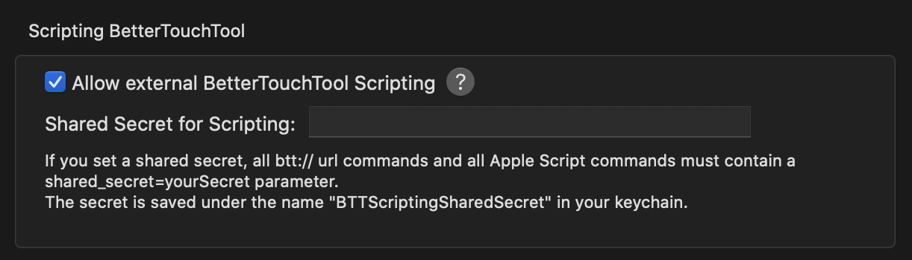
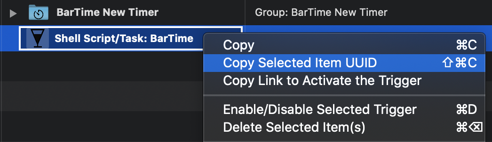

<h1 align="center">BarTime</h1>
<p>
  
  
  <a href="#" target="_blank">
    
  </a>
</p>

> A visual progress bar style countdown timer to your Touch Bar via BetterTouchTool. 


## Prerequisites

- node >=8.0.0
- BetterTouchTool > 2.430

## Install

### BetterTouchTool

BetterTouchTool is a paid app available for purchase on its [website](https://folivora.ai/), or through a [Setapp](https://setapp.com/) subscription. 

Enable external scripting through Preferences -> Scripting BTT.



Download BarTime's BTT presets and install them. 

- [Touch Bar Preset](https://github.com/pnlng/bartime/releases/latest/download/BarTime.bttpreset)
- [Named Trigger Preset](https://github.com/pnlng/bartime/releases/latest/download/BarTime_long_press.bttpreset)

### BarTime Server

Clone or [download](https://github.com/kefranabg/readme-md-generator/archive/master.zip) the project. In the directory, run

```sh
# npm
npm install
# OR yarn
yarn install
```

Then start the server. 

```sh
make serve
```

#### Daemon & Login Item

You may want to run BarTime as a daemon. In that case, you could use 

```sh
make demon
```

There are a few ways to launch the above script at login. 

- [Native solutions](https://stackoverflow.com/questions/6442364/running-script-upon-login-mac) as discussed on Stack Overflow (Automator, `launchd`, etc)
- Paid third-party apps:
  - [Keyboard Maestro](https://www.keyboardmaestro.com/main/)
  - [Lingon](https://www.peterborgapps.com/lingon/)

## Usage and Configuration

To hook up the BTT widget and the server, copy the main widget's UUID. 



Then go to 

```
http://localhost:4975/bartime/config/set?uuid=YOUR_UUID
```

Things should be ready to go!

Using the time picker widget to set a timer:


Using the bar widget to start a timer of default length (15m). 


For the bar widget, the following actions are available. 

- **Tap**
  - start default timer, if idle
  - pause/resume, if a timer is set
- **Long press**
  - stop current timer

## Acknowledgements

BarTime took inspirations from the following projects. 

- [Timebar](https://www.macupdate.com/app/mac/47506/timebar): Turn your menubar into a subtle timer.
  - Unfortunately it's been many years since Timebar was last maintained/available. I still miss the app dearly. This is *the* reason I wrote BarTime.
- [ng-vu/tomato](https://github.com/ng-vu/tomato): Tomato is a command for running pomodoro in background. It's designed mainly to stay in MacBook touchbar.
- [mathiasvr/tiny-timer](https://github.com/mathiasvr/tiny-timer): :clock2: Small countdown timer and stopwatch module.

***
_This README was generated with ❤️ by [readme-md-generator](https://github.com/kefranabg/readme-md-generator)_